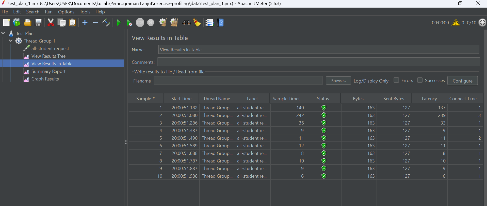
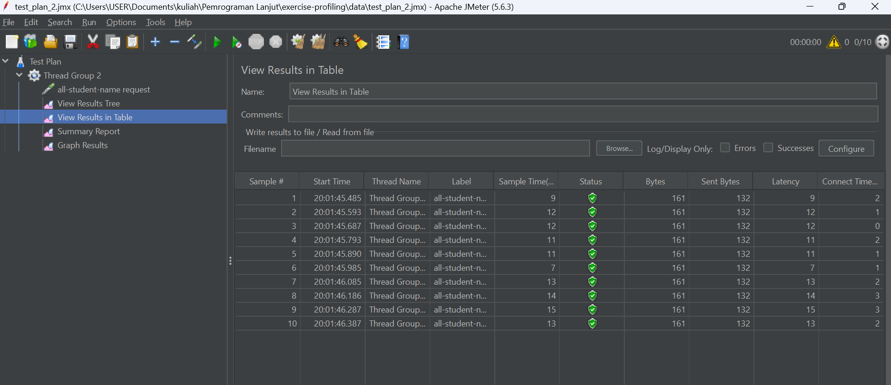
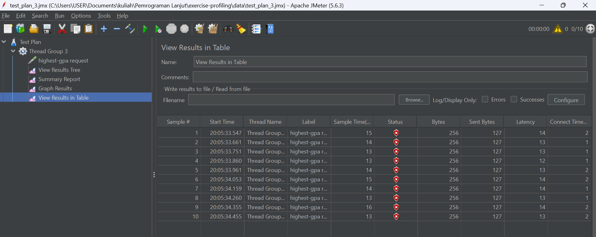
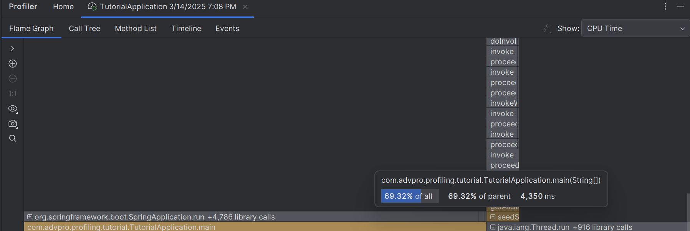
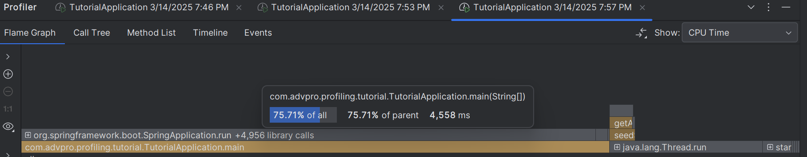
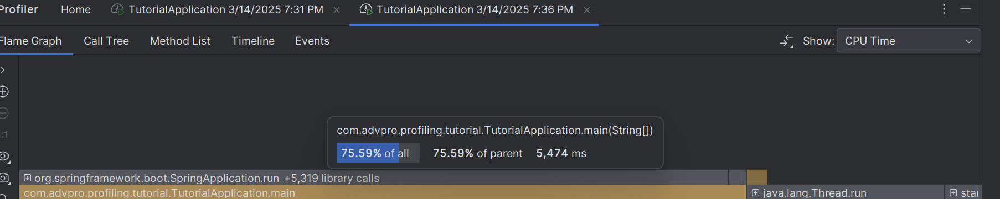
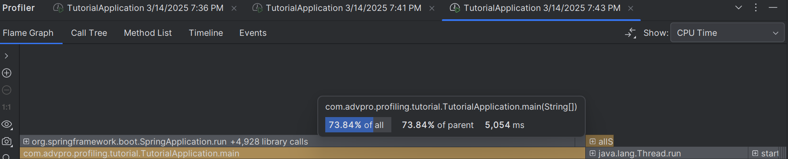
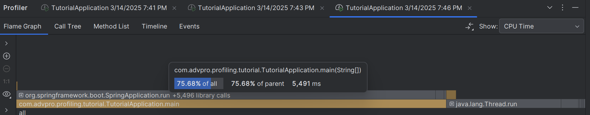
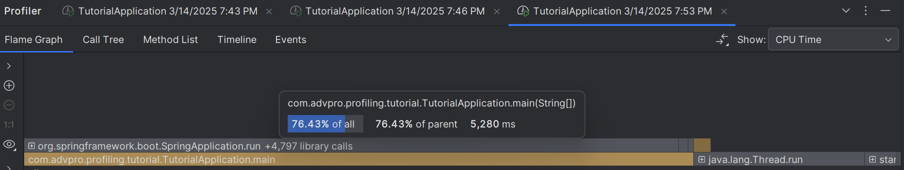

## Modul 5

1. perbedaan performance testing dengan JMeter dan profiling dengan Intellij Profiler
Jmeter menguji performa sistem dengan mensimulasikan banyak pengguna dan mengembalikan waktu respons, jumlah permintaan per detik, dan tingkat kesalahan.
sedangkan profiling dengan Intellij Profiler mencari tahu performa runtime aplikasi sampai ke fungsi yang mempengaruhinya

2. How does the profiling process help you in identifying and understanding the weak points
in your application?
profiling mengidentifikasi bottlenecks fungsi yang membuat aplikasi berjalan dengan lambat. profiling mengembalikan penggunaan CPU, memori, waktu eksekusi, dan perilaku fungsi yang ada.

3. Do you think IntelliJ Profiler is effective in assisting you to analyze and identify
   bottlenecks in your application code?
Intellij Profile sudah cukup efektif dengan memberikan hasil analisis dalam bentuk flame graph, call tree, method list, timeline, dan events dalam CPU time dan total times

4. What are the main challenges you face when conducting performance testing and
   profiling, and how do you overcome these challenges?
menurut saya hal yang paling sulit dalam performance testing dan profiling adalah proses optimisasi fungsi yang berkaitan. 
optimisasi dilakukan dengan mengubah logika yang ada untuk mengurangi waktu eksekusi tanpa mengubah fungsionalitasnya.

5. What are the main benefits you gain from using IntelliJ Profiler for profiling your
   application code?
Intellij Profile memudahkan pencarian fungsi yang melemahkan eksekusi program. dengan demikian kita bisa langsung optimisasi kodenya dan mendapatkan waktu eksekusinya.

6. How do you handle situations where the results from profiling with IntelliJ Profiler are not
   entirely consistent with findings from performance testing using JMeter?
saya akan menjalankan ulang aplikasi dan melakukan performance testing kembali. selain itu, saya akan mengecek database dan faktor lainnya yang berkaitan dengan aplikasi karena jmeter mensimulasikan beberapa pengguna sedangkan intellij profiler mengukur performa dan kualitas fungsi ketika suatu thread dijalankan (faktor yang mempengaruhi hasil berbeda).

7. What strategies do you implement in optimizing application code after analyzing results
   from performance testing and profiling? How do you ensure the changes you make do
   not affect the application's functionality?
setelah menganalisa hasil dari performance testing dan profiling saya akan mencari bottleneck dan fokus untuk mencari alternatif dari fungsi yang berkaitan. 
kemudian saya akan melakukan performance testing dan profiling kembali, terus menerus hingga terdapat perubahan yang cukup signifikan misalnya seperti yang ada di tutorial 20%. 
cara saya memastikan fungsionalitas aplikasi tidak berubah adalah dengan membuat test-test terlebih dahulu sehingga jika ada perubahan akan mudah terdeteksi. 

### sebelum optimisasi
/all-student

/all-student-name

/highest-gpa

### sesudah optimisasi
/all-student

/all-student-name

/highest-gpa

### perubahan CPU time
/all-student

/all-student-name

/highest-gpa

