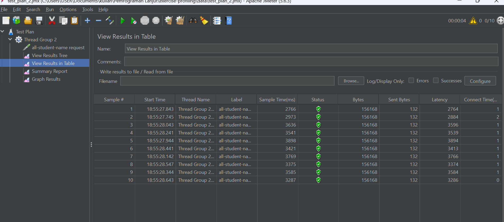

## Modul 5

1. perbedaan performance testing dengan JMeter dan profiling dengan Intellij Profiler

2. How does the profiling process help you in identifying and understanding the weak points
in your application?

3. Do you think IntelliJ Profiler is effective in assisting you to analyze and identify
   bottlenecks in your application code?

4. What are the main challenges you face when conducting performance testing and
   profiling, and how do you overcome these challenges?

5. What are the main benefits you gain from using IntelliJ Profiler for profiling your
   application code?

6. How do you handle situations where the results from profiling with IntelliJ Profiler are not
   entirely consistent with findings from performance testing using JMeter?

7. What strategies do you implement in optimizing application code after analyzing results
   from performance testing and profiling? How do you ensure the changes you make do
   not affect the application's functionality?

### sebelum optimisasi
/all-student

/all-student-name

/highest-gpa

### sesudah optimisasi

